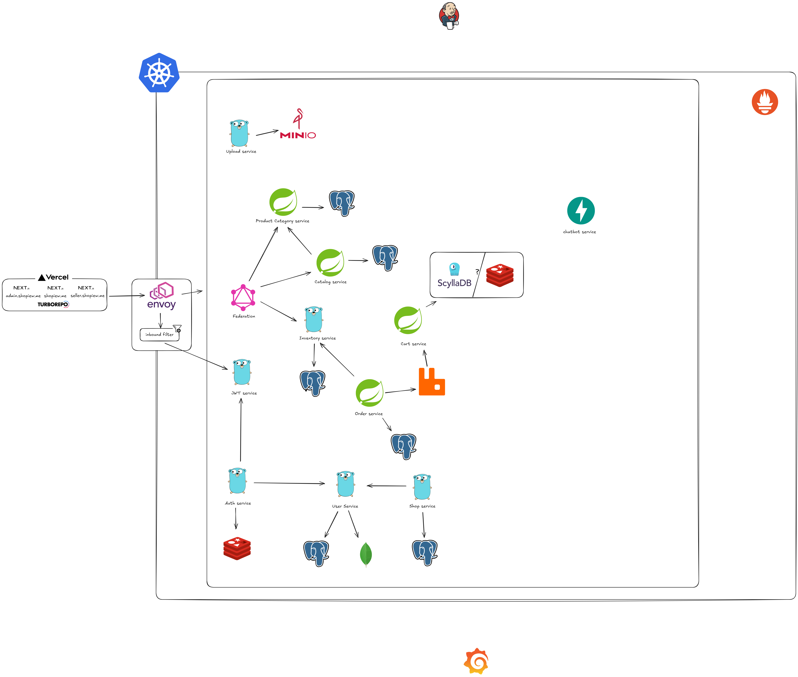

# eCommerce Microservices Platform

A modern, microservices-based eCommerce platform with frontend applications for customers, sellers, and administrators.

## Project Overview

This project implements a complete eCommerce ecosystem with multiple services and frontend applications:
### Architecture


### Backend Microservices

#### REST API Services (Port 8080 internally)

- **Products Service**: Manages product information and inventory
  - External Port: `8081`
  - Built with Spring Boot

- **Product Reviews Service**: Handles customer reviews and ratings
  - External Port: `8082`
  - Built with Go (Echo framework)
  - Routes:
    - `GET /reviews`: Retrieve product reviews
    - `POST /reviews`: Create new reviews

- **Product Categories Service**: 
  - External Port: `8083`
  - Uses Closure table pattern for efficient hierarchical category management
  - Built with Spring Boot
  - Endpoint: `GET /api/product-category/hierarchy`

- **Auth Service**: Handles user authentication and authorization
  - External Port: `8084`
  - Built with Go (Echo framework)
  - Integrates with JWT Service and Users Service

- **Shops Service**: Manages shop information and operations
  - External Port: `8085`
  - Built with Go (Echo framework)

- **Upload Service**: Handles file uploads (images, etc.)
  - External Port: `8086`
  - Built with Go (Echo framework)
  - Integrates with MinIO for object storage

#### gRPC Services (Port 50050 internally)

- **JWT Service**: Provides JSON Web Token functionality
  - External Port: `50051`
  - Built with Go

- **Users Service**: Manages user information and accounts
  - External Port: `50052`
  - Built with Go

#### Infrastructure Services

- **Kong API Gateway**: Provides API gateway functionality
  - Ports: 8000 (HTTP), 8443 (HTTPS), 8001 (Admin API), 8444 (Admin API HTTPS)

- **MinIO**: Object storage for files and images
  - Ports: 9001 (API), 9002 (Console)

- **OPA Server**: Open Policy Agent for authorization policies
  - Port: 8181

- **Prometheus**: Monitoring and metrics collection
  - Port: 9090

### Frontend Applications

1. **Customer Storefront** ([Shopiew](https://github.com/TranXuanPhong25/shopiew)):
   - Built with Next.js 
   - Features:
     - Product discovery grid with filtering
     - Product detail pages with specifications
     - Customer reviews and ratings
     - Shopping cart functionality
     - Category-based browsing

2. **Seller Portal** ([Shopiew Seller](https://github.com/TranXuanPhong25/shopiew-seller)):
   - Built with Next.js
   - Allows sellers to manage products and inventory

3. **Admin Dashboard** ([Shopiew Admin](https://github.com/TranXuanPhong25/shopiew-admin)):
   - Built with Vue 3 + TypeScript + Vite
   - Provides administrative controls for the platform

## Architecture

The system follows a microservices architecture pattern with:

- **API Gateway**: Kong handles routing, authentication, and rate limiting
- **Service Discovery**: Docker Compose service names used for service discovery
- **Data Storage**: PostgreSQL databases for each service that requires persistence
- **Caching**: Redis for the Auth service
- **Monitoring**: Prometheus for metrics collection
- **Authorization**: Open Policy Agent (OPA) for centralized policy enforcement
- **Object Storage**: MinIO for file storage (S3-compatible)

## Getting Started

### Prerequisites

- Docker and Docker Compose
- Go 1.20+ (for development)
- Java 17+ (for Spring Boot services)
- Node.js 18+ (for frontend applications)

### Running the Microservices

Using Docker Compose:

```bash
# Build all services
docker-compose build

# Start all services
docker-compose up -d

# View logs
docker-compose logs -f

# Stop all services
docker-compose down
```

### Development Setup

For local development without Docker:

1. Start the infrastructure services:

```bash
docker-compose up -d postgres-product-reviews postgres-product-categories postgres-users postgres-products postgres-shops auth-redis minio
```

2. Run individual services locally:

```bash
# For Go services (example with auth service)
cd auth
go mod download
go run server.go

# For Spring Boot services (example with products service)
cd products
./mvnw spring-boot:run
```

## API Documentation

- Kong Admin API: http://localhost:8001
- API Gateway: http://localhost:8000
- Service-specific documentation available at each service's `/swagger` endpoint

## Monitoring and Observability

- Prometheus UI: http://localhost:9090

## Contributing

1. Fork the repository
2. Create a feature branch: `git checkout -b feature/your-feature-name`
3. Commit your changes: `git commit -am 'Add some feature'`
4. Push to the branch: `git push origin feature/your-feature-name`
5. Submit a pull request

## License

This project is licensed under the MIT License - see the LICENSE file for details.
